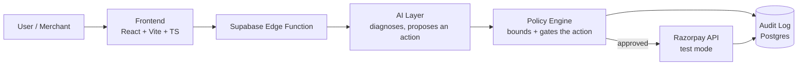

# 🚀 [Project Name]

> [One-line pitch — e.g. "An AI agent that catches failing subscription payments and recovers them before they become churn."]

<p align="center">
  
  
  
  
  
  
</p>

<p align="center">
  <a href="#-live-demo--pitch-video">Demo</a> ·
  <a href="#-track--the-bar">Track</a> ·
  <a href="#-architecture">Architecture</a> ·
  <a href="#-getting-started">Getting Started</a>
</p>

---

## 📌 Table of Contents
- [The Problem](#-the-problem)
- [The Solution](#-the-solution)
- [Live Demo & Pitch Video](#-live-demo--pitch-video)
- [Track & The Bar](#-track--the-bar)
- [Key Features](#-key-features)
- [Architecture](#-architecture)
- [Guardrails & Audit Trail](#-guardrails--audit-trail)
- [Results](#-results)
- [One Failure Case We Handle Gracefully](#-one-failure-case-we-handle-gracefully)
- [Tech Stack](#-tech-stack)
- [Getting Started](#-getting-started)
- [Project Structure](#-project-structure)
- [Roadmap](#-roadmap)
- [Team](#-team)

## 🧩 The Problem
[2–4 sentences. Name the exact loss or pain point, with a number if you can — e.g. "X% of subscription renewals fail silently, and 70% of those never recover without manual follow-up."]

## 💡 The Solution
[2–4 sentences on what you built and why it's the right fix. Be specific about what makes it an *agent* rather than a script — what does it decide on its own, and where does it stop?]

## 🎬 Live Demo & Pitch Video

| | Link |
|---|---|
| 🔗 Live app | [add link]() |
| 🎥 5-min pitch video | [add link]() |
| 📂 Repo | this one — **make sure it's set to Public before you submit** |

> ⚠️ **Before you submit:** this repo is currently **Private**. Razorpay's build review reads your public repo directly, so switch it to Public (Settings → General → Danger Zone) before filling the application form.

## 🎯 Track & The Bar
**Track:** `[e.g. Track 03 — AI Revenue Recovery]`

**The bar we built to:** `[state your track's specific bar in your own numbers — e.g. "₹X recovered across a batch of Y failed payments, with a compliant escalation path and a stopping rule after Z retries."]`

## ✨ Key Features
- [Feature 1]
- [Feature 2]
- [Feature 3]

## 🏗️ Architecture



[Swap this for your real diagram — GitHub renders Mermaid natively, no image export needed. The pattern reviewers are scoring for: the AI *proposes*, a separate deterministic layer *decides*. It should never have unmediated authority to move money.]

**Why this shape:** [1–3 sentences on your actual design decisions and trade-offs — panels probe this harder than code style.]

## 🔒 Guardrails & Audit Trail
- **Explainable:** [every action logs *why* it decided to do X]
- **Bounded:** [hard limits — e.g. max retry count, max refund amount]
- **Gated:** [a check or human-in-the-loop step before any money actually moves]
- **Auditable:** [where a reviewer can see the audit table or logs — path or link]

## 📊 Results
[Put real, honest numbers here — a batch run beats one cherry-picked success. If it's precision/recall, show both plus false-positive cost. If it's match rate, show the exception list too.]

| Metric | Value |
|---|---|
| [e.g. Batch size] | [e.g. 50 synthetic records] |
| [e.g. Recovery / match rate] | [ ]% |
| [e.g. False positives] | [ ] |

## 🩹 One Failure Case We Handle Gracefully
[Razorpay's brief explicitly asks for this on every track. Describe one real scenario where your agent could fail or be uncertain, and exactly what it does instead of guessing — flags for human review, backs off, logs and stops, etc.]

## 🛠️ Tech Stack
| Layer | Choice |
|---|---|
| Frontend | React + TypeScript + Vite |
| Styling | Tailwind CSS |
| Backend / DB | Supabase (Postgres + PL/pgSQL functions, Row Level Security) |
| Payments | Razorpay APIs (test mode) |
| AI | [model / provider you used] |

## 🚀 Getting Started

### Prerequisites
- Node.js 18+
- A [Supabase](https://supabase.com) project
- A [Razorpay test-mode](https://razorpay.com/docs/payments/dashboard/account-settings/api-keys/) key ID & secret

### Installation
```bash
git clone https://github.com/Arief-177043/Razorpay-Buildathon.git
cd Razorpay-Buildathon
npm install
```

### Environment variables
Create a `.env` file in the project root:
```env
VITE_SUPABASE_URL=your-supabase-project-url
VITE_SUPABASE_ANON_KEY=your-supabase-anon-key
RAZORPAY_KEY_ID=your-test-mode-key-id
RAZORPAY_KEY_SECRET=your-test-mode-key-secret
```
> Never expose `RAZORPAY_KEY_SECRET` in frontend code — keep server-side Razorpay calls inside a Supabase Edge Function.

### Database
```bash
supabase link --project-ref your-project-ref
supabase db push
```

### Run locally
```bash
npm run dev
```

## 📁 Project Structure
```
├── src/                # React + TypeScript app
├── supabase/           # Postgres migrations & edge functions
├── .bolt/              # Bolt.new project config
├── index.html
├── vite.config.ts
└── tailwind.config.js
```

## 🗺️ Roadmap
- [ ] [Next feature]
- [ ] [Scaling / hardening step]

## 👤 Team
Built by [Your Name] ([@Arief-177043](https://github.com/Arief-177043)) for the [Razorpay AI Buildathon 2026](https://razorpay.com/buildathon/).
